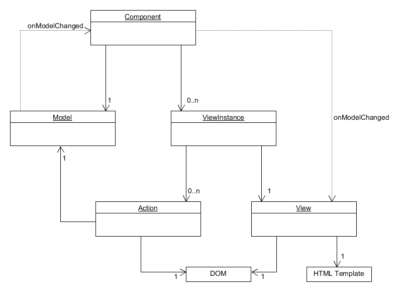

# Component

The only magic is the one-way DOM bindings.

Native DOM event bindings.  No magic, which makes it a whole lot easier to debug.

Promise based component system.  Allows for components to asynchronously fetch data and resolve once the component is ready for consumption.  In most cases, components should wait on their child components to resolve before resolving themselves.


#### Design: 



#### TODO:
* Figure out scoping.  Should I use '_createChildComponent'.  That would make it easy but would lead to easy mistakes by developers.  I want something more explicit so that we can scape the messenger to a group of components...
* Figure out initialization...


#### Usage:
```
//var component = new Component({
//	container: HTMLElement,
//	model: "root-model-name",
//	template: "root-template-name"
//});


//var module = new Module();


//module
//	.init({
//		container: HTMLElement,
//		model: "root-model-name",
//		template: "root-template-name"
//	})
//	.then(rootComponent => {});


var component = new Component();


component
	.module({
		container: HTMLElement,
		model: "root-model-name",
		template: "root-template-name",
		util: ["module-util-name", ...], // optional
		inputs: {} // optional
	})
	.then(rootComponent => {});


//component
//	.create({
//		name: "model-name",
//		inputs: {} // optional
//	})
//	.then(myComponent => {});


_module
	.createChildComponent({
		model: "model-name",
		inputs: {} // optional
	})
	.then(childComponent => {});


component.model("model-name", function (
	_model, _api, _protected, _messenger, _module, _inputs
) {
	"use strict";

	_model...
	_module.createChildComponent();
	_module.util;
});


component.action("action-name", function (
	_element, _model, _api, _protected, _messenger
) {
	"use strict";

	_element.addEventListener();	
});


component.template(
	"template-name",
	"template string OR template path",
	["action-name", ...] // optional
);


component.util("util-name", function (
	_rootComponent
) {
	
});

```
